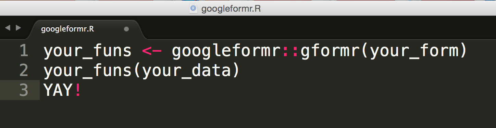

**googleformr** let's you POST data more securely to Google Forms without needing authentication or permissions like with Google Sheets.

Installation
============

To download the development version of **googleformr**:

Download the [zip
ball](https://github.com/steventsimpson/googleformr/zipball/master) or
[tar
ball](https://github.com/steventsimpson/googleformr/tarball/master),
decompress and run `R CMD INSTALL` on it, or use the **pacman** package
to install the development version:

    if (!require("pacman")) install.packages("pacman")
    pacman::p_load_gh("steventsimpson/googleformr")

DEMO
=======

**googleformr** comes pre-loaded with a Open-Source Thanksgiving Google Form to demo on; <a target="_blank" href="https://medium.com/@data_steve/open-source-a-way-of-giving-thanks-9d7962a4518b">read more about it</a>. 

```r
googleformr::why_R_u_thankful("") # <- your thanksgiving goes here
```

Here's how I made it
```r
# create function
form <- "https://docs.google.com/forms/d/1Ttl_SGI1cjRHSw_oU7kwxnGESoMwf4BU4NMAqPA-BRs/viewform"
why_R_u_thankful <- googleformr::gformr(form,
                          custom_reply= "Thanks for Giving Thanks!")

# send thanksgiving!
why_R_u_thankful("R community in my city have been really supportive to my learning.")
```

You can create your own linked-function to a Google Form using: 
```r
# create function
form <- "your_google_form_url"
your_func <- googleformr::gformr(form)

# send data
your_func(your_data)
```


You can extract Google Form question text or entry points using:

```r
# questions
form <- "your_google_form_url"
form %>% get_form() %>% get_form_questions()

# entry ids
form %>% get_form() %>% get_form_entry_ids()
```

Contact
=======

You are welcome to: 
- submit suggestions and bug-reports at: <https://github.com/steventsimpson/googleformr/issues> 
- send a pull request on: <https://github.com/steventsimpson/googleformr/> 
- compose a friendly e-mail to: <steven.troy.simpson@gmail.com>
